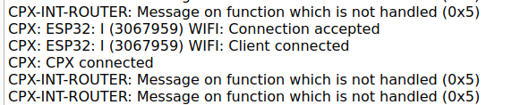

# IAA LAB03 Drone communications
## Author : Bastien Pillonel & Rachel Leupi
## Date : 23.04.2024

### Objectives :
The objectif of this lab is to implement functionnalities on the GAP8 and STM32. We will implement PC connection as well.

### 2. Transfer information from UART to STM32 :
In this part it was ask to us to implement a c function designed to facilitate communication between a GAP8 processor and an STM32 microcontroller via UART. 

Its primary objectives include retrieving frequencies related to the FC from the GAP8 processor and transmitting them to the STM32 microcontroller. Upon execution, the function retrieves the FC frequencies using pi_freq_get() function, and then constructs a CPXPacket_t packet to encapsulate the frequency data for transmission. 

It's noteworthy that a corresponding program on the STM32 side is required to read the UART data.

- **What is the value of the FC frequency ?**

The value of fc Frequency is 50MHz:


### 3. Create a WIFI Task :

- **In the CfClient console do you only see your prints ? If not, explain the other prints.**



Like we can see above we do not receive only our prints in the cfclient. We receive also other message from the esp32, the micro controller wifi. It is the Wi-Fi network interface between the PC and the drone, so we receive connection status log for example. In the CFClient we recieve the message CPX-INT-ROUTER Message on function which is not handled (0x5) because we couldn't flash the stm32 with the main.c receive_app_msg succesfully. The makefile kept saying that the path we specified is a directory we tried to give the absolute and relative path but neither of them worked. Nevertheless we succesfully receive the frequency with the cpxPrintToConsole function.

- **What part of the data flow is responsible for these ?**

The part responsible for these messages is the esp32 that receives Wi-Fi messages from the PC and forwards them to the GAP8 through UART. CPX has its own communication stack which allow to route packet on the different intermediate on the ai deck and drone itself (GAP8, esp32, stm32 and host wifi=>pc);

Here we specify in the rx_wifi_task we wait on the CPX_F_WIFI_CTRL function to provides us the packet with wifi setup and signaling information. Knowing the only wifi interface on the drone is the esp32 I think the wifi control function is implemented on the esp. When the esp32 get a new wifi connection info it sends it to the GAP8 via SPI with the function CPX_F_WIFI_CTRL in the CPX header. Then we can retrieve connection status by casting data field into (WiFiCTRLPacket_t) and the status will be stored in the first byte.

- **What happens when you connect 2 clients to the GAP8 ? Is it an expected behavior ?**

If I connect another client to the drone nothing happens or is printed. But on the host side we are unable to connect more than one host to the drone. We need to disconnect one host in order to connect the other one. I can't realy explain why we can't connect connect multiple host at the same time. I searched in the ai deck documentation and in the NINA-W102 datasheet but I couldn't find any explanation. 

### 4. Image acquisition :

For this task we followed the tutorial in the README file.
We implement this solution, the one proposed for this lab :

 

The camera_task function orchestrates the acquisition and transmission of images. Initially, it sets up a delay to ensure system stability before starting its operations. It allocates memory for the image buffer and initializes the camera for image capture. Utilizing a semaphore for synchronization, it initiates image capturing asynchronously and awaits its completion. Upon capture completion, the image undergoes resizing to fit specific requirements. Subsequently, if a client is connected, the function transmits the resized image via Wi-Fi.

### 5. Transfer information from GAP 8 to PC via Wifi :

- **What is the max packet size ?**

The maximum packet size is determined by the underlying communication protocol and the network infrastructure being used. In this case, since the communication is happening over WiFi, the maximum packet size is typically determined by the Maximum Transmission Unit (MTU) of the WiFi network. The MTU defines the maximum size of a packet that can be transmitted over the network without fragmentation. The MTU for SPI communication (GAP8 -> esp32) is 1022bytes.

- **Explain your implementation of the communication protocol.**

we  created a function that creates a header packet containing information about the image captured by the drone. This includes metadata such as width, height, depth, type, and size of the image.

We use the ```cpxSendPacketBlocking``` function then to send the header to the route configured before with ```cpxInitRoute(CPX_T_GAP8, CPX_T_WIFI_HOST, CPX_F_APP, &txp.route)```. This function sends the packet over the WiFi connection to the designated host (in this case, a PC).

Following the transmission of header information, the actual image data is sent using the sendBufferViaCPXBlocking function => because image size can exceed MTU we split the image data into multiple packet, the reciever is in charge to gather all the data afterward.

We reuse the python script opencv-viewer.py from the wifi-img-streamer project. To gather all the image data our python script fetch img size by unpacking header structure and then we append each batch of data to the imgStream data array until we've gather every data from every packet.

### 6. Image processing : 

- **Provide a plot of one original image and one one the cropped images**

original : 


cropped : 


- **Explain your cropping algorithm.**

The cropping algorithm implemented in the reshape_img function crops an input image by taking only the inner center pixels, resulting in an output image with specified dimensions.

The function calculates the offsets (xOffset and yOffset) needed to center the crop region within the input image. These offsets are calculated by finding the difference between the dimensions of the input image and the desired dimensions of the output image, and then dividing by 2. This ensures that the crop region is centered both horizontally and vertically within the input image.

Next, The function iterates through each pixel in the output image.

For each pixel in the output image, the corresponding pixel from the input image is determined based on the current coordinates of the output image and the calculated offsets. This mapping ensures that pixels are copied from the center region of the input image to the output image.

The pixel data from the input image corresponding to the calculated coordinates is copied to the output image.

After iterating through all pixels in the output image, the resulting output image contains only the inner center pixels of the input image, cropped to the specified dimensions.

- **What is the shape of the original image ?**

The Shape of the drone originals images is 324 pixels of width and 244 pixels of height.


